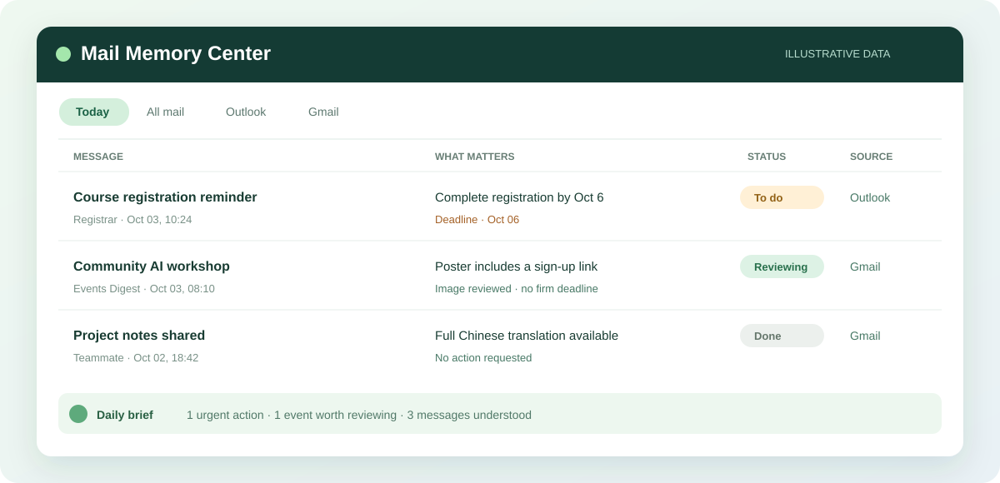

<div align="center">


<h1>Mail Memory · 邮件记忆库</h1>
<p><a href="https://github.com/clover475/clover-mail/actions/workflows/ci.yml"></a></p>
<p><strong>Turn your inbox into a private, searchable memory.</strong></p>
<p><strong>把收件箱变成私有、可搜索的个人记忆库。</strong></p>
<p>Read from Apple Mail. Understand with the model you choose. Work in Feishu. Keep the archive on your Mac.</p>
<p>从 Apple Mail 只读导入，任选模型理解邮件，在飞书处理，邮件档案保存在自己的 Mac 上。</p>
<p><a href="docs/setup.md">Setup / 安装配置</a> · <a href="docs/privacy.md">Privacy / 隐私</a> · <a href="docs/architecture.md">Architecture / 架构</a> · <a href="LICENSE">MIT license / MIT 许可证</a></p>

</div>

---

## What it does / 项目简介

Mail Memory collects messages already cached by Apple Mail and turns them into a searchable personal archive. It does not need your Apple ID or mailbox password, and never sends, moves, deletes, or marks source messages.

Mail Memory 从 Apple Mail 已缓存的邮件建立个人档案，不需要 Apple ID 或邮箱密码，也不会发送、移动、删除或标记原始邮件。

Each message is archived locally and can be copied to a Feishu Mail Center row, including messages still awaiting AI analysis. Your chosen model can produce a Chinese title and summary, full readable-text translation, concrete actions, explicit deadlines, and notes about image coverage. Handling states edited in Feishu sync back to the local archive.

邮件会先归档在本机，也可以同步到飞书 Mail Center；尚未完成 AI 分析的邮件也会保留。你选择的模型可以生成中文标题与摘要、完整可读正文翻译、具体行动项、明确截止日期和图片覆盖说明。你在飞书修改的处理状态会同步回本机档案。

```text
Apple Mail (read-only / 只读)
        ↓
Local SQLite archive / 本机邮件档案
   ├── Chosen AI provider / 自选 AI 模型
   ├── Feishu Mail Center / 飞书邮件中心
   ├── Daily brief → Feishu + email / 每日简报 → 飞书 + 邮件
   ├── Local search / 本机搜索
   └── Optional private Notion mirror / 可选的私有 Notion 镜像
```



<sub>Illustrative interface with synthetic mail; your Feishu Base is created in your own workspace. / 界面仅为合成邮件示意图；飞书多维表格会创建在你自己的工作空间。</sub>

## Features / 功能

| Capability / 能力 | English | 中文 |
| --- | --- | --- |
| Multiple accounts / 多邮箱 | Reads cached Apple Mail messages across accounts; keeps the source account and mailbox. | 读取 Apple Mail 中多个账户已缓存的邮件，并记录来源账户和邮箱。 |
| Incremental sync / 增量同步 | First scan defaults to 30 days; later scans overlap by 3 days and deduplicate. | 首次默认同步近 30 天；后续扫描重叠 3 天并自动去重。 |
| AI understanding / AI 理解 | Use MiMo, OpenAI-compatible Chat Completions, or Anthropic Messages for summaries, full text translation, actions, deadlines, and searchable facts. | 可选 MiMo、兼容 OpenAI Chat Completions 的接口或 Anthropic Messages，生成摘要、全文翻译、行动项、截止日期和可搜索事实。 |
| Newsletter images / Newsletter 图片 | Embedded and attached images are selected locally; remote images are off by default. | 在本机筛选内嵌和附件图片；默认不加载远程图片。 |
| Feishu Mail Center / 飞书邮件中心 | Shows all archived mail, readable text, translations, status, and deadlines. | 展示全部已归档邮件、可读正文、翻译、处理状态和截止日期。 |
| Daily Brief / 每日简报 | Synthesizes priorities and actions, then sends to private Feishu chat and optional SMTP email. | 整理重点和待办，发送到私有飞书会话及可选 SMTP 邮箱。 |
| Historical search / 历史查询 | Local full-text search plus a selected-provider query planner in the CLI. | 使用本机全文搜索，并由所选模型辅助理解命令行自然语言查询。 |
| Optional Notion / 可选 Notion | Mirrors readable original text and translation to a private database you authorize. | 将可读原文和翻译同步到你授权的私有数据库。 |

## Quick start / 快速开始

Requires macOS, Python 3.11+, Apple Mail with locally downloaded messages, an API key for one supported model provider, and a Feishu self-built app. Gmail/SMTP and Notion are optional. Apple Mail's local index is undocumented, so check your macOS version before relying on it.

需要 macOS、Python 3.11+、已下载邮件的 Apple Mail、任一支持模型的 API Key，以及飞书自建应用。Gmail/SMTP 和 Notion 均为可选。Apple Mail 本地索引并非公开稳定接口，请先在自己的 macOS 版本上验证。

```sh
python3 -m venv .venv
.venv/bin/python -m pip install -e .

mkdir -p "$HOME/.config/clover-mail"
cp config/runtime.example "$HOME/.config/clover-mail/runtime.env"
chmod 600 "$HOME/.config/clover-mail/runtime.env"
# Enter the provider key in a hidden local prompt / 在本机隐藏输入模型密钥
.venv/bin/python scripts/configure_ai.py
export CLOVER_MAIL_ENV_FILE="$HOME/.config/clover-mail/runtime.env"

.venv/bin/clover-mail doctor
.venv/bin/clover-mail sync --days 30
.venv/bin/clover-mail prepare --limit 5
.venv/bin/clover-mail analyze --limit 5
.venv/bin/clover-mail feishu-setup
.venv/bin/clover-mail feishu-publish --limit 20
```

Read the [setup guide](docs/setup.md) before granting Full Disk Access or enabling scheduling. It explains Feishu scopes, private credentials, a one-message validation, SMTP, Notion, and launchd. The public repository contains no real mail, credentials, or private history.

授予“完全磁盘访问权限”或启用定时任务前，请先阅读[配置指南](docs/setup.md)。文档说明了飞书权限、私有凭据、单封邮件验证、SMTP、Notion 和 launchd。公开仓库不包含真实邮件、密钥或私人历史记录。

## Configure with GPT or Claude / 交给 GPT 或 Claude 配置

Open this repository in a coding assistant running **locally on your Mac**, such as a GPT coding workspace or Claude Code. Paste the prompt below. The package and CLI command are currently named `clover-mail`.

在 Mac 本机用 GPT 编程工作区或 Claude Code 打开本仓库，然后粘贴下面的提示词。当前 Python 包名和命令行命令仍为 `clover-mail`。

> Set up Mail Memory on this Mac from the repository `https://github.com/clover475/clover-mail`. Read `README.md`, `docs/setup.md`, and `docs/privacy.md` first. Install the project, run the synthetic tests, then guide me through `clover-mail doctor` and a one-message validation. Have me enter provider keys only in `~/.config/clover-mail/runtime.env` through the hidden local prompt; never ask me to paste secrets into this chat or print them. Do not change or send mail in Apple Mail. Before granting any cloud permission, explain the exact permission and wait for my approval.

> 请从仓库 `https://github.com/clover475/clover-mail` 在这台 Mac 上配置 Mail Memory。先阅读 `README.md`、`docs/setup.md` 和 `docs/privacy.md`。安装项目并运行合成数据测试，然后带我运行 `clover-mail doctor` 并验证处理一封邮件。让我只通过本机隐藏输入将模型密钥写入 `~/.config/clover-mail/runtime.env`；不要让我在聊天里粘贴密钥，也不要打印密钥。不要修改或发送 Apple Mail 邮件。授予任何云端权限前，先说明具体权限并等我批准。

Configure one provider with the local helper. It asks for the provider, HTTPS endpoint, model ID, and hidden API key, then writes the settings to an owner-only file without displaying the key. Choose the model ID shown in that provider's console. OpenAI-compatible APIs must implement Chat Completions; image support depends on the provider and model.

使用本机配置脚本选择模型。脚本会询问供应商、HTTPS 地址、模型 ID，并隐藏输入 API Key；随后将配置写入仅当前用户可读的文件，不会显示密钥。模型 ID 请使用该供应商控制台提供的值。兼容 OpenAI 的接口需要支持 Chat Completions；图片能力取决于供应商和具体模型。

```sh
.venv/bin/python scripts/configure_ai.py
```

Available providers / 支持的供应商：

```text
mimo                 MiMo
openai-compatible    OpenAI or another compatible Chat Completions API / OpenAI 或其他兼容 Chat Completions 的接口
anthropic            Anthropic Claude Messages API / Anthropic Claude Messages API
```

Never paste API keys into GPT/Claude chat. Each AI request sends the selected email text and images to your configured endpoint. Choose a provider you trust and review its retention, training, pricing, and model capabilities. Switching provider/model keeps its analysis cache separate; existing MiMo cache keys remain compatible.

不要把 API Key 粘贴到 GPT/Claude 对话中。每次 AI 请求都会把选中的邮件正文和图片发送给你配置的模型接口。请自行评估供应商的数据保留、训练、价格和模型能力。切换供应商或模型后会使用独立分析缓存；原 MiMo 缓存键仍兼容。

## Search and Daily Brief / 历史查询与每日简报

```sh
.venv/bin/clover-mail search 'registration' --days 30
.venv/bin/clover-mail ask '最近两周有哪些需要处理但还没完成的事？'
.venv/bin/clover-mail brief-preview
```

`ask` sends the question to the selected provider to plan a search; matching messages are retrieved from the local archive. A Feishu chat bot is not included. Connecting ChatGPT or Claude to the optional Notion database requires a separate authorized connection; copying mail to Notion alone does not grant either assistant access.

`ask` 会将查询问题发给所选模型规划搜索条件，再从本机档案检索匹配邮件。本版本不包含飞书聊天机器人。让 ChatGPT 或 Claude 查询可选的 Notion 数据库，需要单独授权连接；仅把邮件复制到 Notion 不会自动授予助手访问权限。

## Scope and limitations / 范围与限制

- **Alpha, personal use:** no hosted service, web dashboard, or account setup wizard. / **个人使用 Alpha 版**：没有托管服务、网页仪表盘或账号配置向导。
- Full translation covers readable MIME/HTML text. PDF, Office files, and some image attachments may remain unsupported or incomplete. / 全文翻译覆盖从 MIME/HTML 提取的可读文本；PDF、Office 文件和部分图片附件可能暂不支持或内容不完整。
- Source-account labels are inferred from Apple Mail mailbox URLs. Verify them with your own accounts. / 邮箱来源标签根据 Apple Mail 邮箱 URL 推断，请用自己的账户检查准确性。
- Live operation requires your own Mac, API credentials, and Feishu permissions; SMTP and Notion require extra setup. CI uses synthetic fixtures only. / 实际运行需要你自己的 Mac、模型凭据和飞书权限；SMTP 与 Notion 需要额外配置。CI 只使用合成测试数据。

**Collect → understand → act → remember.** / **收集 → 理解 → 处理 → 记忆。**

## License / 许可证

[MIT](LICENSE). See [CONTRIBUTING.md](CONTRIBUTING.md) and [SECURITY.md](SECURITY.md) for contribution and security reporting guidance.

[MIT 许可证](LICENSE)。贡献方式和安全问题报告请见 [CONTRIBUTING.md](CONTRIBUTING.md) 与 [SECURITY.md](SECURITY.md)。
